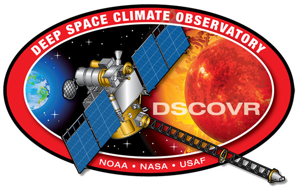
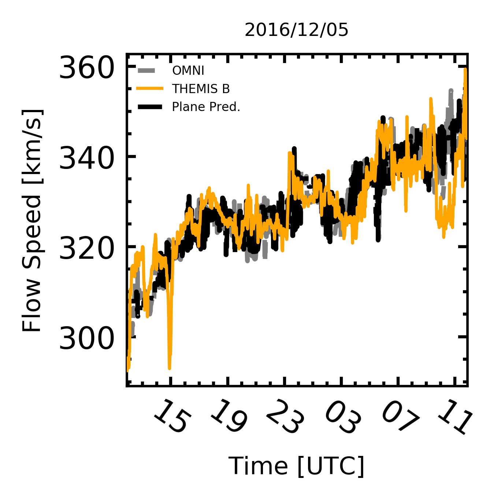

.. Solar Wind Matching documentation master file, created by
   sphinx-quickstart on Thu Mar 21 11:29:02 2019.
   You can adapt this file completely to your liking, but it should at least
   contain the root `toctree` directive.

Welcome to Solar Wind Matching's documentation!
===============================================

.. toctree::
   :maxdepth: 4
   :caption: Contents:

Context
-------

Introduction
~~~~~~~~~~~~~

Currently, space weather predictions of the solar wind at Earth primarily depend on solar wind measurements from two spacecraft, Wind and the Advanced Composition Explored (ACE). Using Wind and ACE, OMNI predicts solar wind conditions at Earth from L1 assuming a plane propagating normal to the ecliptic. Relying on two spacecraft for solar wind predictions at earth is not ideal, since the large scale structure of the solar wind is not required to be normal to the ecliptic. In addition to Wind and ACE, two other spacecraft, the Charge, Element, and Isotope Analysis System on the Solar and Heliospheric Observatory (SOHO/CELIAS) and Deep Space Climate Observatory (DSCOVR), exist at L1. They all regularly observe the proton spectra at approximately one minute resolution. DSCOVR, ACE, and Wind also possess magnetometers that have a time resolution less than 16s. Using the magnetic fields and proton parameters for these four spacecraft, we create a mathematically unique prediction of the solar wind properties at Earth by assuming the propagating front is a plane. We use a Dynamic Time Warping (DTW) algorithm to find the time offset between spacecraft. DTW allows for each observation in the solar wind of a given spacecraft to map to a single spacecraft. As such, we obtain a distribution of time offsets, thus a distribution of propagating solar wind planes. Here we present a series of time periods around solar wind discontinuities and compare the four spacecraft DTW solution to OMNI predictions and near Earth observations from THEMIS B. We find the DTW solution does a better job of predicting the observations in THEMIS B, especially when a front contains multiple discontinuities.

Observations
~~~~~~~~~~~~~

To account for observational uncertainty we regularize the data by subtracting the 5th percentile then normalizing by the 95th percentile. In particular, the SOHO/CELIAS solar wind speeds may be very different in magnitude and variance compared to ACE, DSCOVR, and Wind. 

Analysis
~~~~~~~~~~~~~

Dynamic Time Warping (DTW) allows us to correlate features in time series observations. Originally adapted for speech recognition, we adopt the algorithm to match solar wind observations between spacecraft. 
To compute a DTW path you must search through the cost matrix to find the path of minimum cost. Since each index value corresponds to a time, the difference between each i,j along the optimal path is a time offset between observed features. As such, you may warp in time any spacecraft observation to another . We used Wind as the reference spacecraft. In order to account for the bulk time offsets between spacecraft, we first search for the average time offset by taking the mean time offset of the central hour allowing 85 minutes of compression. Then we reselected the data taking into account the bulk offset and find a second DTW path allowing for less compression (generally less than 30 minutes).
Since there are currently four spacecraft at L1, we may assume a planar phase front. From the planar assumption, we may uniquely solve for the 3 components of the velocity by taking time and position offsets of three of the spacecraft compared to the remaining reference spacecraft at L1. After we know the velocity components of the plane, we can calculate the distance and predict the time delay between the plane at the reference spacecraft.

Conclusions/Future Work
~~~~~~~~~~~~~~~~~~~~~~~

We present six time periods and see qualitatively our method produces reasonable predictions of the solar wind at THEMIS-B. However, we still need to put the predictive power on a quantitative ground. We also show the importance of maintaining at least four spacecraft solar wind measuring spacecraft at L1. It allows for mathematically unique solutions if one assumes solar wind phase fronts are planes. While the planar assumption is useful for science, it may also improve solar wind predictions at Earth if all four spacecraft took high cadence and fidelity observations.

Code
-----

Example
~~~~~~~

Here I will breifly describe the process for using the code to make predections of the solar wind.
First, you will need to import the modules needed to successfully call the code.

.. code-block:: python

    import model_time_range as mtr
    from scipy.io import readsav
    from fancy_plot import fancy_plot
    import matplotlib.pyplot as plt
    from glob import glob
    import numpy as np
    import matplotlib.dates as mdates
    import pandas as pd

Then you need to specify a time window you are interested in predicting forward. 
Generally, this time should be in reference to the Wind spacecraft observations and should
include several hours of solar wind observations for best results.

.. code-block:: python

    #Wind to get DTW solution
    window = pd.to_timedelta(1.*3600.,unit='s')
    
    #Setup format for datetime string to pass to my_dtw later
    dfmt = '{0:%Y/%m/%d %H:%M:%S}'

    #Interesting feature in the solar wind at Wind
    twind1 = pd.to_datetime('2016/12/05 22:52:48')

    #Set up the time range you want to predict around the interesting features
    start_t1 = dfmt.format(twind1-12.*window)
    end_t1 = dfmt.format(twind1+12.*window)

Now that you have a time range specified you will not pass that time range to the module time range class and 
set up a few parameters in model_time_range.dtw_plane. Doing this creates a dtw_plane instance that you should 
immediately tell to read in cdf files associated with the given time range. Along with reading in the cdf files,
init_read also cleans and puts the data into pandas.DataFrames. 

.. code-block:: python

    my_dtw1 = mtr.dtw_plane(start_t1,end_t1,nproc=4,penalty=True,earth_craft=['THEMIS_B'])
    my_dtw1.init_read()

Once you tell the class to read in the information about the spacecraft,
you may begin modifying the dtw_plane class object in other ways.
Perhaps, one of the most useful is the parameter to use when comparing spacecraft observations.
The default is to find the magnetic field component with the largest jump, but I have found
the magnitude of the magnetic field is better for long term matching.
As such, we can set the par keyword during the initial call to dtw_plane or by updating the par attribute later.

.. code-block:: python

    my_dtw1.par = ['Bt']

Once you select the matching parameter, 
you should use the iterate_dtw function to find the time offsets between the same features at the 4 observatories.
The iterate_dtw function works by default allows for up to 85 minutes of compress in DTW in a first pass. After an average offset
is found in the inner section of observations,
the program applied that offset to the spacecraft observations relative to the Wind spacecraft observations.
Then rereads in the data fot the same time range with the time offset applied.
Once that step finishes, the code then finds a new DTW solution allowing for 30 minutes of compression.
You can modify the compression times by changing the pr_1 and pr_2 keywords in iterate_dtw.

.. code-block:: python

    my_dtw1.iterate_dtw(pr_1=85.0, pr_2=30.0)

Now that you have a series of time offsets between the spacecraft,
you may solve for a velocity plane and propagate that plane to any point in space.
This code will propagate the magnitude of the solar wind speed to the earth_craft parameter,
which was defined in the initial call. We will also want to limit planes more than 70 degrees
from +X\ :sub:`GSE`\ . See `Weimer et al. (2003) <https://ui.adsabs.harvard.edu/#abs/2003JGRA..108.1026W/abstract/>`_ for 
more information about making this cut.

.. code-block:: python

    my_dtw1.pred_earth(cut_deg=70.)

The inital plot will be ugly and not contain OMNI solar wind predictions.
As such, run the omni_plot function on the class object to get a nice,
perhaps publication worthy, plot.

.. code-block:: python

    #Create plot comparing OMNI and plane solution
    mtr.omni_plot(my_dtw1,hours=mdates.HourLocator(interval=4))

Modules
~~~~~~~

The following modules are the primary analysis modules:

.. toctree::
    :maxdepth:1

    source/code/load_cdf_files.rst
    source/code/matching_events_full_res.rst
    source/code/model_time_range.rst
    source/code/multi_dtw.rst
    source/code/setup.rst
    source/code/unit_test_model_time.rst
    source/code/unit_test_my_dtw.rst
    

The following modules are the primary analysis modules:

.. toctree::
    :maxdepth:1

    source/cdf/get_cdf_files.rst
    source/cdf/get_soho_files.rst

Indices and tables
==================

* :ref:`genindex`
* :ref:`modindex`
* :ref:`search`
